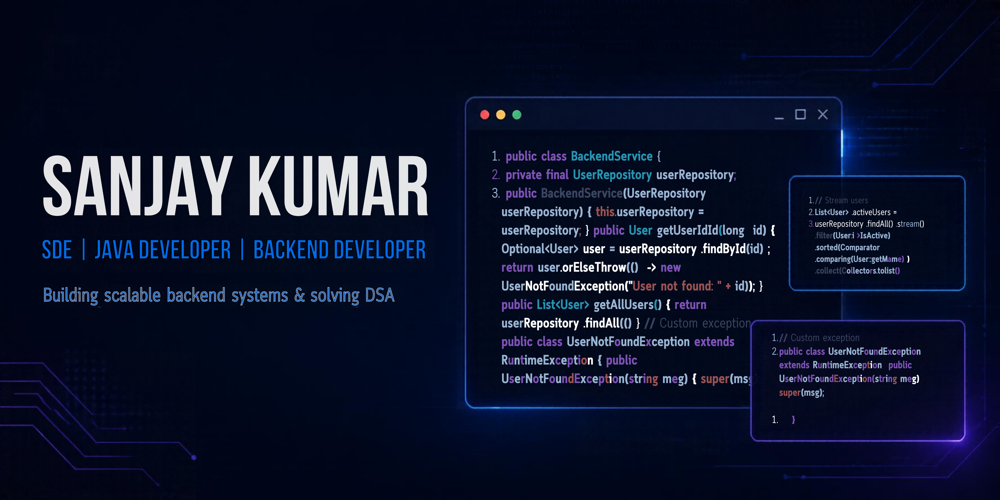

  

 
<h1 align="center">Hi 👋, I'm Sanjay Kumar</h1>
<h3 align="center">Software Engineer Trainee | Backend Development | Problem Solving</h3>

  
  

## 👨‍💻 About Me

* 💼 Software Engineer Trainee at Cisco
* ☕ Focused on Java and Spring Boot backend development
* 🧠 Practicing Data Structures and Algorithms using C++
* 🏗️ Building CareerOS_X, a career-management SaaS backend
* 🔐 Learning authentication, authorization, JWT and Spring Security
* 🗄️ Exploring REST APIs, SQL, PostgreSQL and database design
* 🐍 Strengthening Python fundamentals and exploring AI-assisted development
* 🎯 Working towards Software Development Engineer (SDE) roles

## 🛠️ Languages and Technologies

  
  
  
  
  
  

## ⚙️ Backend, Database and Developer Tools

  
  
  
  
  
  
  
  

## 🚀 Featured Projects

### CareerOS_X — Career Management SaaS

Developing a backend-focused application for career planning and professional development.

* Java and Spring Boot
* REST API development
* PostgreSQL and relational database design
* Authentication and authorization
* JWT and refresh-token implementation in progress

🔗 [Explore my repositories](https://github.com/sanjaykumar-dev-26?tab=repositories)

### Python AI Code Quality & Documentation Analyzer

A learning project planned to explore Python, code analysis and AI-assisted documentation.

* Python fundamentals
* Code quality analysis concepts
* Automated documentation
* AI integration as a learning goal

🔗 [Explore my GitHub](https://github.com/sanjaykumar-dev-26?tab=repositories)

## 📊 GitHub Statistics

  

  

## 🔥 GitHub Contribution Streak

  

## 📈 Contribution Activity

  

## 🌐 Connect With Me

  
  
  
  
  
  

---

  <i>Consistency. Problem-solving. Continuous improvement. 🚀</i>

